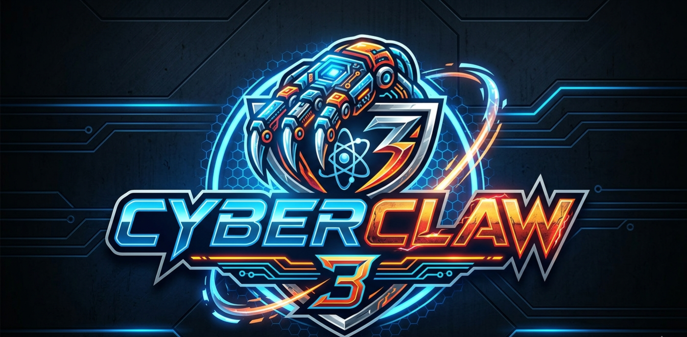

# Cyber Claw 3 



A PHP agent that turns the Proton Lumo API into a local Linux shell assistant. You describe a goal in natural language, the model proposes shell commands, you approve each one with y/n, the agent executes and loops until the goal is done.

Built with Lumo API. 

## Features

- **ReAct loop** over Lumo's chat completions endpoint (SSE streaming)
- **TOTP authentication** gate, RFC 6238, pure PHP, no external libs
- **Per-command y/n confirmation** before any execution
- **Unrestricted shell access** on approval: any binary, pipes, redirects, absolute paths
- **Session persistence**: every turn saved to disk, can resume anytime
- **Dry run mode**: preview the full plan without executing anything
- **Session listing**: browse past runs with status and turn counts
- **Audit log** of every auth attempt, command, rejection, and exit code
- **Defensive JSON parsing**: brace-counted extraction + raw-newline rescue to survive small-model output quirks
- **Self-contained**: only PHP with curl extension required, no composer, no dependencies

## Requirements

- PHP 8.0 or newer (uses `match` expression)
- `curl` extension enabled
- A working Proton Lumo API key
- Any TOTP authenticator app on your phone (Aegis, 2FAS, Authy, Proton Authenticator, etc.)

## Files

| File              | Purpose                                       |
|-------------------|-----------------------------------------------|
| `totp-setup.php`  | One-shot script to generate the TOTP secret  |
| `agent.php`       | The agent to test it first with small tasks no root                             |
| `cyberclaw3.php`       | The agent itself full powers                             |
| `.totp_secret`    | Generated base32 secret, chmod 600            |
| `agent.log`       | Append-only audit log                         |
| `sessions/`       | One JSON file per session                     |

## Install

1. Drop `totp-setup.php` and `agent.php` into a folder create a folder "tools" the test agent works only inside "tools"
2. Open `agent.php` and fill in your credentials near the top:
   ```php
   $API_KEY     = 'your_lumo_api_key_here';
   $MODEL       = 'lumo-garbage';
   ```
   The model name is not validated server-side, so `lumo-fast`, `lumo-thinking`, `auto`, or anything else works.

3. Test the agent:
     
```
	 php agent.php "create an index.html with a blue hello world page"
	 php agent.php "show me the first 5 lines of test.txt"
	 php agent.php "delete index.html and create a new one saying goodbye"
	 php agent.php "find all html files and show their word counts"
```
		 
4. Generate the TOTP secret:
		 

   ```
   php totp-setup.php
   ```
   The script prints a QR code URL, a raw secret, and the current 6-digit code.
4. Add the secret to your authenticator app: either scan the QR (heads up, the QR is rendered by quickchart.io, so the secret transits their server) or enter the base32 secret manually.
5. Verify the code shown by your app matches the "Current code" printed by the setup script.
6. Done. You're ready to run the agent.

## Usage

```
php cyberclaw3.php [--dry] [--continue <id>] <otp> "<goal>"
php cyberclaw3.php --list
```

### Flags

| Flag                  | Description                                               |
|-----------------------|-----------------------------------------------------------|
| `--dry`               | Show every proposed command without executing anything    |
| `--continue <id>`     | Resume a previous session by ID                           |
| `--list`              | Print all past sessions sorted by most recent             |
| `--help` or `-h`      | Print usage info                                          |

### Positional args

| Arg       | Description                                                       |
|-----------|-------------------------------------------------------------------|
| `<otp>`   | Current 6-digit code from your authenticator                      |
| `<goal>`  | Natural language instruction. Pass `""` when resuming to just continue. |

## Examples

**Basic run**
```
php cyberclaw3.php 127384 "create an index.html with a blue hello world page"
```

**Fix a broken file**
```
php cyberclaw3.php 482910 "fix the JSON syntax errors in broken.json, save it back"
```

**Dangerous task, preview first**
```
php cyberclaw3.php --dry 582013 "delete all .log files older than 30 days under /var/log"
```
Review the plan. If you like it, run again without `--dry` using a fresh TOTP code.

**List past sessions**
```
php cyberclaw3.php --list
```
Output:
```
ID                        STATUS    TURNS   UPDATED               GOAL
-------------------------------------------------------------------------------
20260418-143022-a1b3      open      3       2026-04-18T14:32:55   fix the JSON syntax errors...
20260418-091205-f8d2      finished  2       2026-04-18T09:12:30   create an index.html with...
```

**Resume a session with new instructions**
```
php cyberclaw3.php --continue 20260418-143022-a1b3 649012 "also validate with jq"
```

**Resume without nudging (agent just keeps going)**
```
php cyberclaw3.php --continue 20260418-143022-a1b3 649012 ""
```

## How it works

1. **TOTP check**: the code you pass is verified against the local secret (±30s window).
2. **System prompt** tells the model to respond with one JSON object per turn: `{thought, action, cmd|message}`.
3. **Agent sends the goal** to Lumo's API  endpoint as SSE.
4. **Response is parsed**: SSE chunks reassembled, `<think>...</think>` stripped, JSON extracted with brace counting.
5. **Command is shown** to you with a `y/N` prompt.
6. **On approval**, `proc_open` runs the command in the agent's working dir and captures output.
7. **Output is fed back** to the model as the next user message.
8. **Session is saved** to `sessions/<id>.json` after every turn.
9. Loop until `action: finish` or `MAX_ITERATIONS` (15) is reached.

## Configuration

Near the top of `cyberclaw3.php`:

| Variable            | Default                                              | What it does                                 |
|---------------------|------------------------------------------------------|----------------------------------------------|
| `$API_KEY`          | placeholder                                          | Your Lumo API token                          |
| `$MODEL`            | `lumo-garbage`                                       | Model string (accepts anything)              |
| `$TEMPERATURE`      | `0.3`                                                | Lower = more deterministic JSON output       |
| `$MAX_TOKENS`       | `2048`                                               | Per completion                               |
| `$WORK_DIR`         | script dir                                           | Where shell commands are executed            |
| `$MAX_ITERATIONS`   | `15`                                                 | Safety cap per session                       |

## Security model

What the TOTP protects you from: someone with access to your shell history or the agent binary running it without your live approval.

What the y/n prompt protects you from: the model hallucinating or misunderstanding and proposing something destructive. You see every command before it runs.

What neither protects against:
- Commands you approve turning out to be destructive in ways you did not anticipate
- Session JSON files containing command outputs (might include secrets if you dump config/env)


Practical hardening:
```
chmod 600 .totp_secret
chmod 700 sessions/
chmod 600 agent.log
```

## Known caveats

- **`lumo-garbage` (and every other unknown model name) routes to the default backend**. The naming is cosmetic.
- **Small Lumo models occasionally emit two JSON objects in one response**. The extractor handles this by taking only the first.
- **Raw newlines inside JSON string values** appear in some responses. The extractor auto-escapes them on a second pass.
- **Session files are plaintext**. Delete sensitive ones manually.
- **TOTP QR in setup script** is rendered via quickchart.io. For full local privacy, copy the printed `otpauth://` URI into a local QR generator or enter the secret manually in your app.

## Troubleshooting

**"Invalid TOTP code"**
System clock drift. Sync with NTP: `sudo timedatectl set-ntp true`. The window is ±30s by default; tighten or widen via the `$window` arg in `totp_verify`.

**"could not parse JSON from model"**
The model returned prose instead of JSON. Retrying usually fixes it. Lowering `$TEMPERATURE` helps. Switching to `lumo-thinking` helps more.

**Session not resuming**
IDs are case sensitive and include dashes. Copy them from `--list` output verbatim.

## Install it in a Kali machine and let your imagination Fly

## License

GPL3
